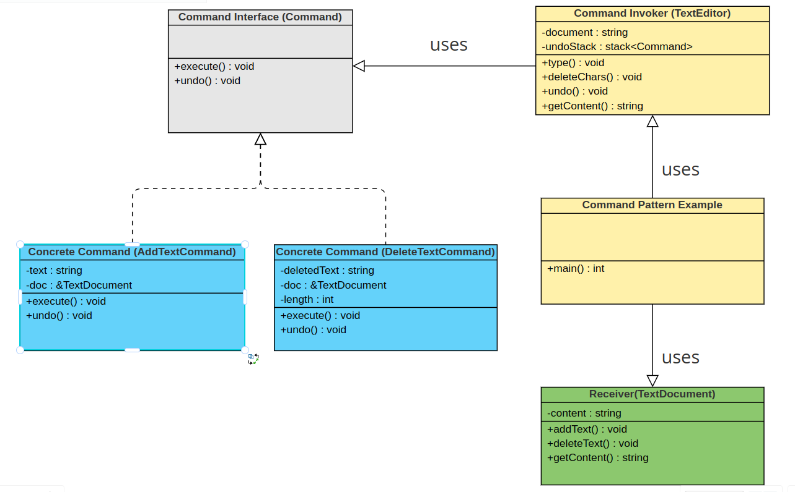

# Command Design Pattern

The Command Design Pattern is a behavioral design pattern that turns a request into a stand-alone object containing all information about the request. This transformation allows you to parameterize methods with different requests, delay or queue a request's execution and support undoable operations.

## Key Concepts
- **Command** : An interface for executing an operation.
- **concreteCommand** : Implements the Command interface and invokes the operation on the Receiver.
-  **Receiver** : Knows how to perform the operations.
- **Invoker** : Asks the command to carry out the request.
- **Client** : Creates a ConcreteCommand object and sets its receiver.

## Benefits
- **Separation of Concerns**: Decouples the object that invokes the operation from the one that knows how to perform it.
- **Extension**: New commands can be added without changing existing code, following the Open/Closed Principle.
- **Composite Commands**: You can compose macros from several commands.
- **Undo Operations**: Supports undoing operations if the Command implementation keeps track of its previous state.

## Usage Scenarios
- When you need to parameterize objects according to an action to perform.
- When you need to queue operations, schedule their execution or execute them remotely.
- When you need to implement reversible operations.

## Example UML Diagram

##  Conclusion
The Command Design Pattern is a powerful tool for creating flexible and extensible software systems. By encapsulating requests as objects, software developers can offer more sophisticated functionalities like undo/redo operations, logging, and transactional behavior.

## References 
- Design Patterns Elements of Reusable Object-Oriented Software by **Erich Gamma**, **John Vlissides**, **Richard Helm**, **Ralph Johnson**

